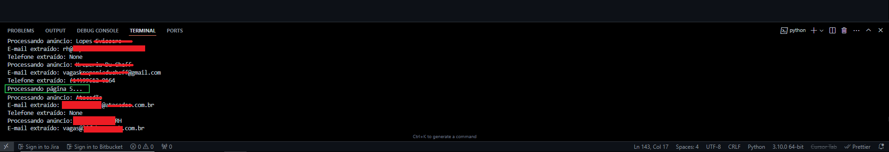
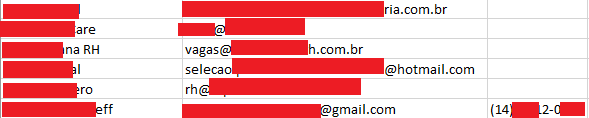

# Scraper infos

## Descrição
Este projeto é um scraper desenvolvido em Python para coletar informações de vagas de emprego de um site específico. Ele extrai dados como nome da empresa, e-mail de contato e telefone, e salva os resultados em um arquivo CSV.

## Tecnologias Utilizadas
- **Python**: Linguagem principal do projeto.
- **Selenium**: Para automação da navegação no site.
- **BeautifulSoup**: Para análise e extração de dados HTML.
- **Pandas**: Para manipulação e salvamento dos dados em CSV.

## Funcionalidades Principais
- Navegação automática pelas páginas do site.
- Extração de e-mails e telefones dos anúncios.
- Salvamento dos dados em um arquivo CSV.
- Paginação automática até a última página disponível.

## Screenshots

